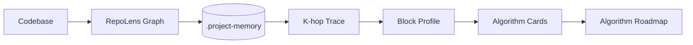
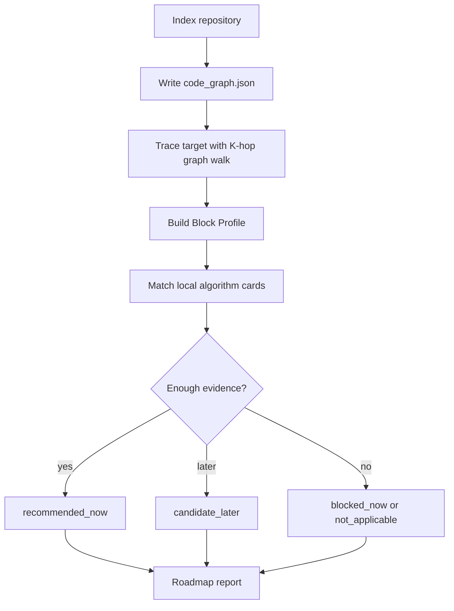

# RepoLens Skill

[中文](./README.zh-CN.md) | English

RepoLens is a lightweight Codex Skill for turning a codebase into an inspectable code knowledge graph, tracing a target module with K-hop graph context, and matching the resulting Block Profile against local algorithm cards.

The project focuses on this path:

```text
codebase -> code knowledge graph -> K-hop trace -> Block Profile -> algorithm cards -> roadmap
```



## Components

| Component | Role |
|---|---|
| `repolens-graph` | Indexes a repository, builds `code_graph.json`, traces route/file/API/component targets, and writes bounded context graphs. |
| `repolens-algo` | Builds Block Profiles, matches local algorithm cards, and writes algorithm opportunity reports. |
| `examples/generated` | Committed sample outputs for the `/discover` demo. |
| `eval` | Baseline comparison notes. |
| `scripts` | Repository validation helpers. |

## Core Concepts

**Code knowledge graph**: a plain JSON graph of files, imports, routes, components, API endpoints, data entities, user actions, ranking signals, algorithm opportunities, and supporting performance signals.

**K-hop context graph**: a bounded graph neighborhood around a target. For example, `/discover` can connect to its page component, API client, backend route, data entities, ranking signals, and supporting evidence.

**Block Profile**: a compact algorithm-facing profile derived from the traced subgraph. It records entities, actions, data shapes, current logic, constraints, objectives, and graph evidence.

**Algorithm cards**: local Markdown/JSON knowledge cards that define when an algorithm is suitable, what data it needs, when it should be blocked, and what the smallest implementation route looks like.

## Workflow



## Algorithm Cards

Current card families:

| Family | Cards |
|---|---|
| Basic algorithm debt | `indexed_lookup`, `rule_table`, `batch_loading`, `bounded_top_k`, `explainable_scoring` |
| Search and retrieval | `hybrid_search_rag`, `semantic_retrieval` |
| Recommendation and personalization | `content_based_recommendation`, `collaborative_filtering` |
| Ranking and exploration | `learning_to_rank`, `contextual_bandit` |

Card-level `required_signals` gate heavier algorithms. For example, learning-to-rank and contextual bandits require exposure plus click or feedback evidence; semantic retrieval requires retrieval or semantic-similarity evidence.

## Generated Outputs

RepoLens writes generated project memory into the analyzed repository:

```text
.project-memory/
  PROJECT_PROFILE.md
  files.json
  imports.json
  routes.json
  components.json
  apis.json
  performance_signals.json
  algorithm_signals.json
  graph_metrics.json
  MODULE_SUMMARIES/
  graph/code_graph.json

.project-memory/traces/
  <target>-context-graph.json
  <target>-trace.md

.project-memory/context-packs/
  <target>.md

.project-memory/algo/
  block_profiles.json
  algorithm_matches.json
  reports/<target>-algo-report.md

.project-memory/reports/
  <target>-perf-report.md
```

The generated `.project-memory/` directory is ignored by Git. Static sample outputs are committed under `examples/generated/`.

## Demo

Runtime requirements:

- Node.js >= 18
- No npm dependencies
- No database, vector store, Web UI, or external AI API

Run the complete reproducible demo:

```bash
npm run demo
```

Run checks:

```bash
npm run check
npm test
```

Open the committed sample outputs:

```text
examples/generated/discover-context-pack.md
examples/generated/discover-context-graph.json
examples/generated/discover-trace.md
examples/generated/discover-block-profile.json
examples/generated/discover-algorithm-matches.json
examples/generated/discover-algo-report.md
```

## Use On Another Repository

```bash
node repolens-graph/scripts/index_project.mjs /path/to/repo
node repolens-graph/scripts/trace_module.mjs /path/to/repo "<route-or-module>" --out .project-memory/traces/target-trace.md
node repolens-graph/scripts/build_context_pack.mjs /path/to/repo "<route-or-module>"
node repolens-algo/scripts/build_block_profiles.mjs /path/to/repo "<route-or-module>"
node repolens-algo/scripts/retrieve_algorithms.mjs /path/to/repo "<route-or-module>"
node repolens-algo/scripts/generate_algo_report.mjs /path/to/repo "<route-or-module>"
```

Example targets:

```bash
node repolens-algo/scripts/build_block_profiles.mjs ~/work/app "/discover"
node repolens-algo/scripts/generate_algo_report.mjs ~/work/app "/api/search"
node repolens-graph/scripts/trace_module.mjs ~/work/app "RecommendationFeed"
```

## Skill Usage

The reusable Skills live in `repolens-graph/` and `repolens-algo/`.

```bash
mkdir -p ~/.codex/skills
cp -R repolens-graph ~/.codex/skills/
cp -R repolens-algo ~/.codex/skills/
```

Invoke them in Codex:

```text
Use $repolens-graph to index this repository and trace /discover.
Use $repolens-algo to identify algorithm opportunities for /discover.
```

## Project Scope

- JSON is the stable graph contract.
- Algorithm recommendations are bounded by local cards and graph evidence.
- Performance signals are supporting graph evidence, not the main product surface.
- The current version intentionally avoids databases, vector stores, Web UI, external AI APIs, and heavy AST frameworks.
