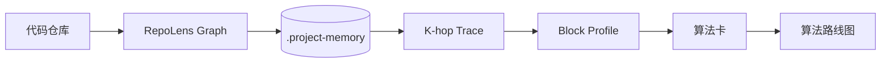
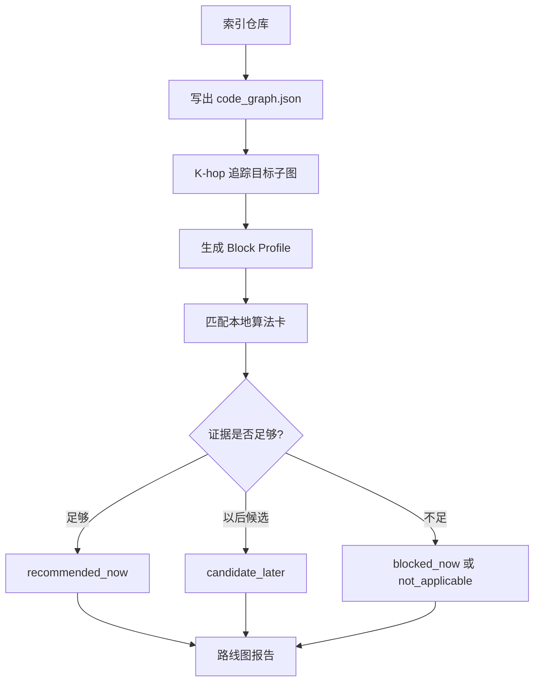

# RepoLens Skill

中文 | [English](./README.md)

RepoLens 是一个轻量级 Codex Skill，用来把代码仓库转换成可检查的代码知识图谱，再围绕目标模块做 K-hop 图谱追踪，生成 Block Profile，并匹配本地算法卡，输出可执行的算法路线。

项目主链路是：

```text
代码仓库 -> 代码知识图谱 -> K-hop trace -> Block Profile -> 算法卡 -> 路线图
```



## 组件

| 组件 | 作用 |
|---|---|
| `repolens-graph` | 索引仓库，生成 `code_graph.json`，追踪 route/file/API/component 目标，并写出 context pack。 |
| `repolens-algo` | 生成 Block Profile，匹配本地算法卡，并写出算法机会报告。 |
| `examples/generated` | 已提交的 `/discover` demo 示例产物。 |
| `eval` | 基线对比记录。 |
| `scripts` | 仓库校验辅助脚本。 |

## 核心概念

**代码知识图谱**：一个普通 JSON 图，记录文件、import、route、component、API endpoint、数据实体、用户动作、排序信号、算法机会和辅助性能信号。

**K-hop trace**：从目标节点出发，沿图关系向外走 K 层得到的有界上下文。例如 `/discover` 可以连到页面组件、API client、后端 route、数据实体、排序信号和支撑证据。

**Block Profile**：从目标子图归纳出的算法画像，包含实体、动作、数据形态、当前逻辑、约束、目标和图谱证据。

**算法卡**：本地 Markdown/JSON 知识卡，描述算法适用条件、所需数据、禁用条件、最小实现版本和指标。

## 工作流



## 算法卡

当前算法卡分组：

| 分组 | 卡片 |
|---|---|
| 基础算法债 | `indexed_lookup`、`rule_table`、`batch_loading`、`bounded_top_k`、`explainable_scoring` |
| 搜索与检索 | `hybrid_search_rag`、`semantic_retrieval` |
| 推荐与个性化 | `content_based_recommendation`、`collaborative_filtering` |
| 排序与探索 | `learning_to_rank`、`contextual_bandit` |

较重的算法由 `required_signals` 控制。例如 learning-to-rank 和 contextual bandit 需要曝光日志以及点击或反馈证据；semantic retrieval 需要 retrieval 或 semantic-similarity 证据。

## 生成产物

RepoLens 会在被分析仓库中写出 `.project-memory/`：

```text
.project-memory/
  PROJECT_PROFILE.md
  files.json
  imports.json
  routes.json
  components.json
  apis.json
  performance_signals.json
  algorithm_signals.json
  graph_metrics.json
  MODULE_SUMMARIES/
  graph/code_graph.json

.project-memory/traces/
  <target>-trace.md

.project-memory/context-packs/
  <target>.md

.project-memory/algo/
  block_profiles.json
  algorithm_matches.json
  reports/<target>-algo-report.md

.project-memory/reports/
  <target>-perf-report.md
```

生成目录 `.project-memory/` 默认不进 Git。静态示例产物提交在 `examples/generated/`。

## Demo

运行要求：

- Node.js >= 18
- 无 npm dependencies
- 不需要数据库、向量库、Web UI 或外部 AI API

运行完整 demo：

```bash
npm run demo
```

运行检查：

```bash
npm run check
npm test
```

查看已提交的示例产物：

```text
examples/generated/discover-context-pack.md
examples/generated/discover-trace.md
examples/generated/discover-block-profile.json
examples/generated/discover-algorithm-matches.json
examples/generated/discover-algo-report.md
```

## 分析其他仓库

```bash
node repolens-graph/scripts/index_project.mjs /path/to/repo
node repolens-graph/scripts/trace_module.mjs /path/to/repo "<route-or-module>" --out .project-memory/traces/target-trace.md
node repolens-graph/scripts/build_context_pack.mjs /path/to/repo "<route-or-module>"
node repolens-algo/scripts/build_block_profiles.mjs /path/to/repo "<route-or-module>"
node repolens-algo/scripts/retrieve_algorithms.mjs /path/to/repo "<route-or-module>"
node repolens-algo/scripts/generate_algo_report.mjs /path/to/repo "<route-or-module>"
```

目标示例：

```bash
node repolens-algo/scripts/build_block_profiles.mjs ~/work/app "/discover"
node repolens-algo/scripts/generate_algo_report.mjs ~/work/app "/api/search"
node repolens-graph/scripts/trace_module.mjs ~/work/app "RecommendationFeed"
```

## Skill 使用

可复用 Skill 位于 `repolens-graph/` 和 `repolens-algo/`。

```bash
mkdir -p ~/.codex/skills
cp -R repolens-graph ~/.codex/skills/
cp -R repolens-algo ~/.codex/skills/
```

在 Codex 中调用：

```text
Use $repolens-graph to index this repository and trace /discover.
Use $repolens-algo to identify algorithm opportunities for /discover.
```

## 项目边界

- JSON 是稳定的图谱协议。
- 算法建议受本地算法卡和图谱证据约束。
- 性能信号只是辅助图谱证据，不是主产品面。
- 当前版本不引入数据库、向量库、Web UI、外部 AI API 或重型 AST 框架。
